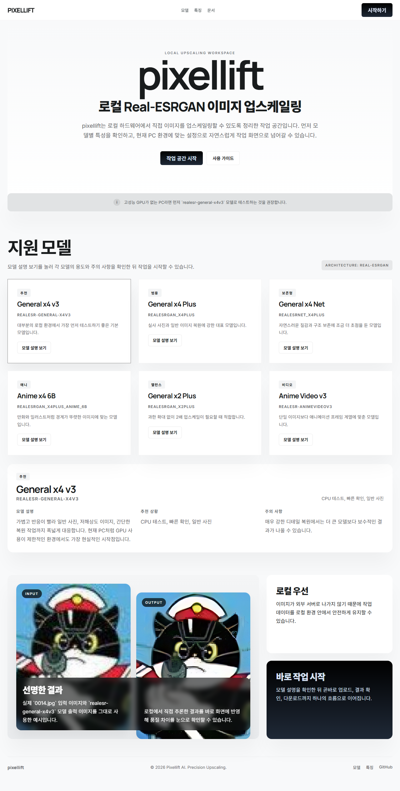
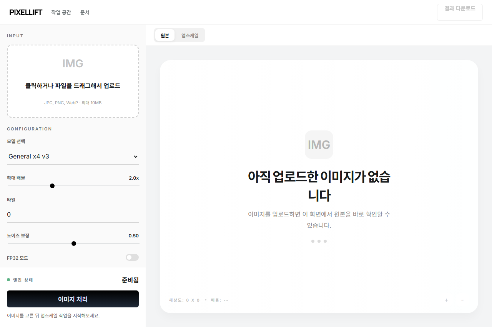

# pixellift

`pixellift`는 로컬 `Real-ESRGAN` 모델을 웹 UI로 감싸서 이미지 업스케일링을 더 쉽게 사용할 수 있게 만든 프로젝트입니다.  
인트로 페이지에서 모델 설명을 확인한 뒤 작업 공간으로 진입할 수 있고, 업로드부터 결과 미리보기와 다운로드까지 한 화면에서 진행할 수 있습니다.

## 화면 미리보기

### 인트로 페이지



### 작업 공간



## 주요 기능

- `Real-ESRGAN` 기반 이미지 업스케일링
- 인트로 페이지에서 모델별 설명 확인
- 이미지 클릭 업로드 및 드래그 앤 드롭
- 업스케일 결과 미리보기와 다운로드
- 작업 이력 확인
- 기본 모델 `realesr-general-x4v3` 적용
- FastAPI 백엔드 + React 프론트엔드 구성

## 프로젝트 구조

```text
ESRGANP/
├─ Backend/
│  ├─ main.py
│  ├─ realesrgan_service.py
│  ├─ requirements.txt
│  └─ start.ps1
├─ Frontend/
│  ├─ package.json
│  ├─ vite.config.js
│  └─ src/
├─ Real-ESRGAN/
│  ├─ .venv/
│  ├─ weights/
│  └─ ...
└─ docs/
   └─ screenshots/
```

## 기술 스택

- 프론트엔드: `React`, `Vite`
- 백엔드: `FastAPI`, `Uvicorn`
- 모델 실행: 로컬 `Real-ESRGAN`

## 실행 방법

### 1. 통합 실행

가장 간단한 방법은 백엔드 스크립트로 전체 서비스를 띄우는 것입니다.

```powershell
Set-Location C:\Users\SCH\Documents\ESRGANP\Backend
.\start.ps1
```

실행 후 브라우저에서 아래 주소로 접속합니다.

```text
http://127.0.0.1:8000
```

### 2. 프론트 개발 서버 실행

프론트만 개발 모드로 실행하려면:

```powershell
Set-Location C:\Users\SCH\Documents\ESRGANP\Frontend
npm install
npm run dev
```

### 3. 백엔드 직접 실행

```powershell
Set-Location C:\Users\SCH\Documents\ESRGANP\Backend
..\Real-ESRGAN\.venv\Scripts\python.exe -m uvicorn main:app --host 127.0.0.1 --port 8000 --app-dir .
```

## API

### `GET /api/health`

서버 상태를 확인합니다.

### `GET /api/models`

사용 가능한 모델 목록을 반환합니다.

### `POST /api/upscale`

업로드한 이미지를 업스케일링합니다.

주요 파라미터:

- `file`
- `model_name`
- `outscale`
- `tile`
- `denoise_strength`
- `fp32`

## 현재 지원 모델

- `realesr-general-x4v3`
- `RealESRGAN_x4plus`
- `RealESRNet_x4plus`
- `RealESRGAN_x4plus_anime_6B`
- `RealESRGAN_x2plus`
- `realesr-animevideov3`

## 참고 사항

- 현재 환경에서는 GPU 사용이 제한될 수 있어 기본 모델을 경량 모델로 맞춰두었습니다.
- 작업 이력은 브라우저 로컬 저장소에 저장됩니다.
- 모델 가중치와 가상환경은 Git에 포함하지 않고 로컬 환경을 재사용합니다.

## 원본 프로젝트

업스케일링 모델과 핵심 추론 코드는 `Real-ESRGAN` 프로젝트를 기반으로 사용합니다.  
원본 저장소: https://github.com/xinntao/Real-ESRGAN
